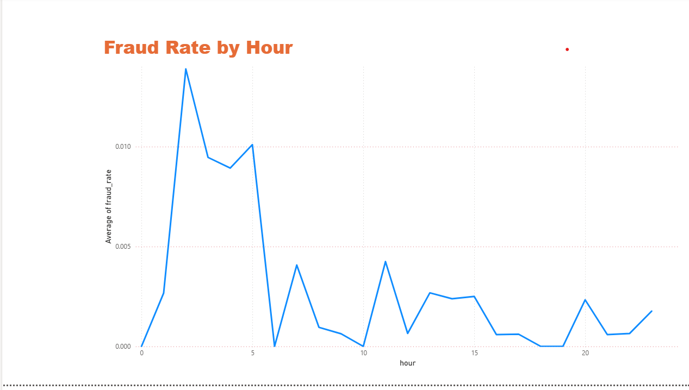
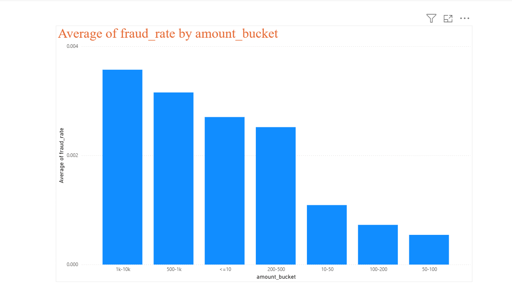
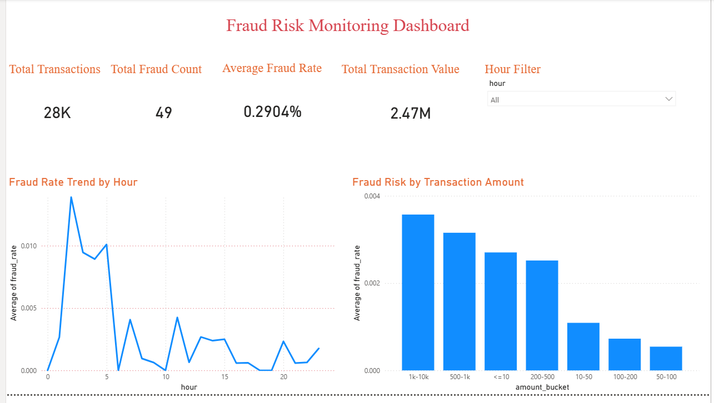

# Fraud Risk Monitoring Dashboard
## Overview
This project demonstrates an end-to-end fraud analytics workflow using Python and Power BI. The goal is to monitor transaction risk patterns, detect fraud trends, and provide business-level insights through interactive dashboards.

## Tools Used
- Python (Pandas, NumPy)
- Power BI
- Data Cleaning & EDA
- KPI Reporting & Visualization

## Key Features
- Hourly Fraud Rate Trend Analysis

  

- Transaction Risk Segmentation by Amount

  

- KPI Monitoring (Transactions, Fraud Count, Fraud Rate)

  

## Business Value
This dashboard helps fraud and risk teams quickly identify high-risk transaction windows and patterns to support proactive monitoring.

## Author
Naveen Kumar Challa